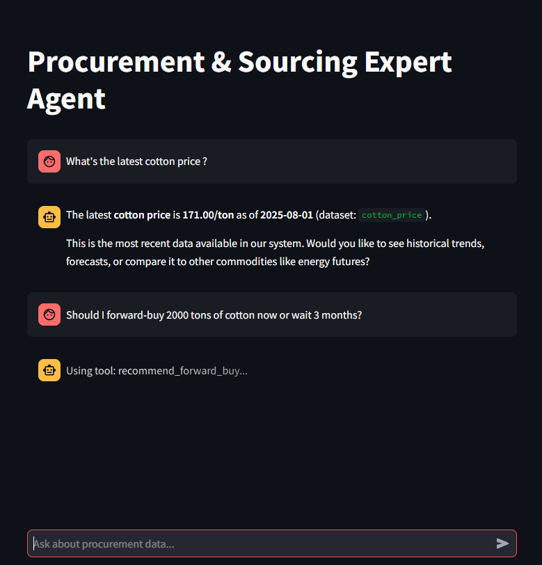

# Procurement & Sourcing Expert Agent

An intelligent agent that helps with procurement decisions by analyzing commodity data and providing market insights.

## Overview

This project implements an agent that analyzes commodity data (Energy Futures, Cotton Price, Cotton Export) to provide strategic procurement recommendations, supplier negotiation support, and market analysis.

## Project Structure

```
Agents - Code Challenge/
├── src/
│   ├── agent/          # LangGraph ReAct agent and system prompts
│   ├── tools/          # Analysis tools for historical, forecast, and driver data
│   ├── data/           # Data loading and caching layer
│   └── ui/             # Streamlit chat interface
├── tests/              # Unit and integration tests
├── docs/               # Detailed documentation
│   ├── Architecture.md # System design and decisions
│   └── Tools_Guide.md  # Tool usage and examples
├── Agents - Code Challenge/
│   └── Data/           # Dataset files (3 commodities)
├── venv/               # Virtual environment
├── .gitignore          # Git ignore patterns
└── README.md           # This file
```

## Setup

### Prerequisites

- Python 3.11 or higher
- Ollama (for local LLM runtime)

### Virtual Environment Setup

**Create Virtual Environment:**

**Windows:**
```bash
python -m venv venv
venv\Scripts\activate
```

**macOS/Linux:**
```bash
python3 -m venv venv
source venv/bin/activate
```

### Installation

1. Ensure virtual environment is activated (you should see `(venv)` in your terminal)
2. Install dependencies:
   ```bash
   pip install -r requirements.txt
   ```
3. Verify installation:
   ```bash
   pip list
   ```

**Installed Dependencies:**
- **AI Agent Framework:** langchain (1.2.2), langgraph (1.0.5), langsmith (0.3.45), langchain-ollama (1.0.1)
- **Data Processing:** pandas (2.2.3)
- **Chat Interface:** streamlit (1.41.1)
- **Testing:** pytest (8.3.4), pytest-cov (6.0.0)
- **Development Tools:** python-dotenv (1.0.1)

### Troubleshooting

**Virtual environment not activating:**
- Verify path: `venv\Scripts\activate` (Windows) or `source venv/bin/activate` (macOS/Linux)

**Module not found after installation:**
- Ensure venv is active (look for `(venv)` prefix in terminal)
- Verify Python path: `python -c "import sys; print(sys.executable)"`

**Ollama connection errors:**
- Check Ollama is running: `ollama list`
- Verify URL in `.env`: `OLLAMA_BASE_URL=http://localhost:11434`

## Configuration

### 1. Copy Environment Template

```bash
cp .env.example .env
```

### 2. Configure Environment Variables

Edit `.env` and update the following settings:

**LLM Configuration:**
- `OLLAMA_BASE_URL`: Ollama server URL (default: `http://localhost:11434`)
- `OLLAMA_MODEL`: Model to use (recommended: `qwen3:8b` for better reasoning, or `llama3.1:8b`)
- `OLLAMA_TEMPERATURE`: Temperature for responses (default: `0.7`, range: 0.0-1.0)

**LangSmith Configuration (for observability):**
- `LANGCHAIN_TRACING_V2`: Enable tracing (default: `true`)
- `LANGCHAIN_API_KEY`: Your LangSmith API key (get from https://smith.langchain.com/)
- `LANGCHAIN_PROJECT`: Project name in LangSmith dashboard (default: `procurement-agent`)

**Data Configuration:**
- `DATA_PATH`: Path to datasets (default: `Agents - Code Challenge/Data/`)

### 3. Install and Configure Ollama

**Install Ollama:**
1. Download from https://ollama.ai
2. Install and start Ollama service:
   ```bash
   ollama serve
   ```
3. Pull a model (recommended: qwen3:8b for better reasoning):
   ```bash
   ollama pull qwen3:8b
   # Or alternatively:
   ollama pull llama3.1:8b
   ```
4. Verify installation:
   ```bash
   ollama list
   ```

**Model Recommendations:**
- **qwen3:8b** (recommended): Better reasoning capabilities for complex procurement analysis, supports thinking tokens for transparency
- **llama3.1:8b**: Stable alternative, simpler responses

### 4. Set Up LangSmith (Optional - for Observability)

LangSmith provides tracing and debugging for agent operations. This is optional but highly recommended for development.

**Create LangSmith Account:**
1. Sign up at https://smith.langchain.com/ (free tier available)
2. Go to Settings → API Keys
3. Click "Create API Key"
4. Copy the generated API key

**Add API Key to .env:**
```bash
# In your .env file, replace the placeholder:
LANGCHAIN_API_KEY=your_actual_api_key_here
```

**Verify Tracing:**
1. Run any LLM operation (the agent will automatically trace)
2. Visit https://smith.langchain.com/
3. Select your project (`procurement-agent`)
4. View traces showing LLM calls, tool usage, and agent decisions

**Troubleshooting:**
- If traces don't appear, verify `LANGCHAIN_TRACING_V2=true` in `.env`
- Check API key is correct (no extra spaces)
- Ensure you're viewing the correct project in dashboard

### 5. Verify Configuration

```bash
python -c "from src.config import get_config_summary; print(get_config_summary())"
```

This will display your current configuration (with API key masked for security).

## Documentation

For more details, see:
- **[Architecture Overview](docs/Architecture.md)** - System design and design decisions
- **[Tools Guide](docs/Tools_Guide.md)** - Detailed tool documentation with examples

## Usage

Run the Streamlit chat interface:
```bash
streamlit run src/ui/streamlit_app.py
```

### Demo



*Chat interface showing the agent responding to procurement queries*

Or use the agent programmatically:
```python
from src.agent.agent import invoke_agent

response = invoke_agent("What's the latest cotton price?")
print(response)
```

## Testing

### Run All Tests
```bash
pytest tests/
```

### Run Unit Tests Only
```bash
pytest tests/ --ignore=tests/integration/
```

**Current Status:** 138 tests passing with 62% coverage

### Run Tests with Coverage Report
```bash
pytest tests/ --cov=src --cov-report=html --cov-report=term
```

Open `htmlcov/index.html` in your browser to view the detailed coverage report.

**Current Coverage:** 62% (target: 60%)

**Coverage by Module:**
- `src/data/models.py`: 100%
- `src/config.py`: 100%
- `src/data/loader.py`: 90%
- `src/tools/drivers.py`: 90%
- `src/tools/historical.py`: 88%
- `src/tools/comparative.py`: 81%
- `src/tools/forecast.py`: 73%
- `src/tools/negotiation.py`: 35%
- `src/tools/recommendations.py`: 15%
- `src/agent/agent.py`: 22%
- `src/agent/llm.py`: 47%
- `src/agent/tools.py`: 37%

### Run Integration Tests

Integration tests validate end-to-end agent behavior with real LLM interactions.

**Quick run:**
```bash
# Requires Ollama to be running
python tests/integration/verify_agent.py
```

**For all integration tests and detailed documentation, see [tests/integration/README.md](tests/integration/README.md).**